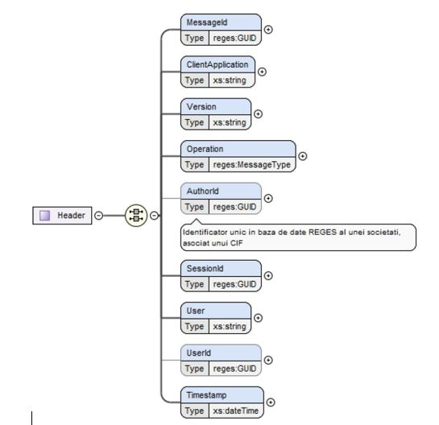

# Documentatia pentru dezvoltatorii de programe software care doresc sa integreze prin API sistemul REGES-ONLINE

## 1. Introducere

Sistemul REGES-Online va fi compus din 2 aplicatii expuse catre public:
1. Portalul cetateanului disponibil la adresa reges.inspectiamuncii.ro
2. Aplicatia angajatorului, disponibila la adresa reges.inspectiamuncii.ro
3. API de acces la aplicatia angajatorului disponibila la adresa api.inspectiamuncii.ro

Accesul la primele 2 aplicatii se va face folosind mai multe mecanisme de acces precum
- user/parola
- identitate digitala ROeID sau eIDAS
- certificat digital calificat

Accesul la API se va face folosind un token de acces individualizat pe CUI/CIF care se va obtine din aplicatia web a angajatorului.

Pentru o buna intelegere a documentatiei tehnice recomandam familiarizarea cu aplicatia Revisal disponibila pentru download pe situl www.inspectiamuncii.ro [Revisal 6.0.9](https://www.inspectiamuncii.ro/reges)

## 2. Principii de functionare API

API expune catre terti puncte de acces pentru:
1. Transmiterea de informatii 
2. Obtinerea raspunsurilor

In diagrama de mai jos sunt prezentati cu titlu de exemplu secventa de pasi prin care informatia ajunge de la un utilizator al sistemului tert pana in baza de date REGES Online si inapoi la utilizator.

Protocolul de acces API este HTTP iar formatarea mesajelor transmise este XML sau JSON. 

Veti regasi exemple de mesaje in fisierul [POSTMAN](RevisalEvents.postman_collection.json) atat pentru formatul XML cat si JSON.

Datele transmise prin API se vor formata respectand schema [Schema REGES 2025](<Schema reges.xsd>).

Toate informatiile transmise catre REGES-Online se ordoneaza intr-o coada si se proceseaza in ordinea FIFO (First In First Out).

Metodele folosite pentru transmiterea de informatii si verificarea raspunsurilor sunt HTTP POST.

### 2.1 Transmiterea de informatii

Se vor putea transmite urmatoarele informatii catre REGES-Online:
1. Adaugari/Modificari ale salariatilor
2. Adaugari/Modificari ale contractelor
3. Actiuni asociate contractelor existente (suspendari, detasari, etc.)

### 2.2 Verificarea informatiilor transmise

Toate mesajele transmise trec prin 2 tipuri de verificari, sincrone si asincrone.

1. Verificarile sincrone se refera la structura mesajului (forma) si tin de respectarea schemei XSD/JSON, orice mesaj care nu respecta schema va fi respins de sistem, nu va fi transmis mai departe pentru procesare
2. Verificarile asincrone se refera la continutul mesajului (fond) si tin de corelarea datelor din interiorul mesajului cu baza de date REGES, astfel incat in registru sa mentinem o baza de date consistenta. 

Pentru o buna gestionare a mesajelor de raspuns recomandam dezvoltatorilor sa salveze ID-urile returnate de REGES Online atat pentru MessageResponse cat si MessageResult, sa asocieze in propriile baze de date aceste ID-uri pentru entitatile salariat si contract, astfel incat sa poata fi referite ulterior.

### 2.2 Obtinerea raspunsurilor

Raspunsurile de la API sunt de 2 tipuri:
1. Raspunsuri sincrone, ca urmare a unui apel de metoda API este returnat un mesaj de tip MessageResponse, care contine un ID de raspuns, denumit si recipisa, acest ID confirma inregistrarea solicitarii si depozitarea acesteia in coada de procesare
2. Raspunsuri asincrone, ca urmare a procesarii REGES-Online a unui apel API, dupa ce s-a finalizat respectiva operatione se pune in coada API a angajatorului respectiv un mesaj de tip MessageResult, mesaj care contine un identificator al rezultatului (cod contract, cod salariat) precum si un cod de succes/fail impreuna cu o explicatie a problemei intalnite.

## 3. Structura datelor si a mesajelor

Schema [Schema Reges 2025](<Schema reges.xsd>) contine toate timpurile de date care pot fi vehiculate de API. 

Un element de baza este tipul Message din care se extind alte tipuri de mesaje. Tipul Message contine obligatoriu o structura de date numita Header in care cel care trimite informatii prin API se identifica, anunta operatia dorita precum si alte metadate utile.

API accepta urmatoarele tipuri de mesaje prin interfata publica (api.inspectiamuncii.ro)

1. Contract
2. Salariat

Mesajele au asociat un tip MessageType, cele de interes pentru API fiind cele specifice contractului (AdaugareContract, RadiereContract, etc.) precum si cele specifice salariatului (InregistrareSalariat, ModificareSalariat, etc.)

## 4. Exemple de mesaje

### 4.1 Modificare contract

Urmatorul mesaj este un exemplu de modificare de contract pentru situatia in care s-a incheiat un acti aditional care actualizeaza elemente din contract care se raporteaza in registrul REGES

    <?xml version="1.0" encoding="UTF-8"?>
    <Message xsi:type="Contract" xmlns="http://www.inspectiamuncii.ro/reges2025"
    xmlns:xsi="http://www.w3.org/2001/XMLSchema-instance"
    xsi:schemaLocation="http://www.inspectiamuncii.ro/reges2025">
        <Header>
            <MessageId>117f9b03-9efb-4f5e-8eab-7ab3b0c792af</MessageId>
            <ClientApplication>117f9b03-9efb-4f5e-8ebb-7ab3b0c792bf</ClientApplication>
            <Version>5</Version>
            <Operation>ModificareContract</Operation>
            <AuthorId>117f9b03-9efb-4f5e-8ebb-7ab3b0c792cf</AuthorId>
            <SessionId>117f9b04-9efb-4f5e-8ebb-7ab3b0c792cf</SessionId>
            <User>Ion</User>
            <Timestamp>2024-06-18T14:19:58.917Z</Timestamp>
        </Header>
        <ReferintaContract>
            <Id>726ca2db-032e-4ea7-be31-f8d8489796f4</Id>
        </ReferintaContract>
        <Continut>
            <ReferintaSalariat>
                <Id>117f9b03-9efb-4f5e-8eaa-7ab3b0c792cf</Id>
            </ReferintaSalariat>
            <Cor>
                <Cod>12345</Cod>
                <Versiune>2</Versiune>
            </Cor>
            <DataConsemnare>2024-06-18T14:19:58.917Z</DataConsemnare>
            <DataContract>2024-06-18T14:19:58.917Z</DataContract>
            <DataInceputContract>2024-06-18T14:19:58.917Z</DataInceputContract>
            <NumarContract>12345</NumarContract>
            <Radiat>false</Radiat>
            <Salariu>1200</Salariu>
            <StareCurenta>
            </StareCurenta>
            <TimpMunca>
                <Norma>NormaIntreaga840</Norma>
                <Repartizare>OreDeZi</Repartizare>
            </TimpMunca>
            <TipContract>ContractIndividualMunca</TipContract>
            <TipDurata>Nedeterminata</TipDurata>
            <TipNorma>NormaIntreaga</TipNorma>
        </Continut>
    </Message>

Observam faptul ca **salariatul** este transmis ca referinta, el ne fiind actualizat cu ocazia acestui mesaj.

### 4.2 Modificare contract cu actiune de incetare

    <?xml version="1.0" encoding="UTF-8"?>
    <Message xsi:type="Contract" xmlns="http://www.inspectiamuncii.ro/reges2025"
    xmlns:xsi="http://www.w3.org/2001/XMLSchema-instance"
    xsi:schemaLocation="http://www.inspectiamuncii.ro/reges2025">
        <Header>
            <MessageId>117f9b03-9efb-4f5e-8eab-7ab3b0c792af</MessageId>
            <ClientApplication>117f9b03-9efb-4f5e-8ebb-7ab3b0c792bf</ClientApplication>
            <Version>5</Version>
            <Operation>ModificareContract</Operation>
            <AuthorId>117f9b03-9efb-4f5e-8ebb-7ab3b0c792cf</AuthorId>
            <SessionId>117f9b04-9efb-4f5e-8ebb-7ab3b0c792cf</SessionId>
            <User>Ion</User>
            <Timestamp>2024-06-18T14:19:58.917Z</Timestamp>
        </Header>
        <ReferintaContract>
            <Id>726ca2db-032e-4ea7-be31-f8d8489796f4</Id>
        </ReferintaContract>
        <Actiune xsi:type="ActiuneIncetare">
            <DataIncetare>2024-06-25T12:43:04.326Z</DataIncetare>
            <Explicatie>Indisciplina</Explicatie>
            <TemeiLegal>Art55LitB</TemeiLegal>
        </Actiune>
    </Message>

Observam cum **contractul** este transmis ca referinta, continutul acestuia ne fiind actualizat cu ocazia transmiterii acestui mesaj.

Referintele la contracte si salariati le veti putea obtine din mesajul MessageResult, in urma procesarii cu succes a acestora.

### 4.3 Inregistrare salariat

Mesajul urmator inregistreaza un salariat nou in sistem.

    <?xml version="1.0" encoding="UTF-8"?>
    <Message xsi:type="Salariat" xmlns="http://www.inspectiamuncii.ro/reges2025"
    xmlns:xsi="http://www.w3.org/2001/XMLSchema-instance"
    xsi:schemaLocation="http://www.inspectiamuncii.ro/reges2025 file:/D:/Proiecte/Ale%20mele/Revisal/RevisalEvents/Communication/Messages/Schemas/SchemaReges.xsd">
        <Header>
            <MessageId>117f9b03-9efb-4f5e-8ebb-7ab3b0c792af</MessageId>
            <ClientApplication>117f9b03-9efb-4f5e-8ebb-7ab3b0c792bf</ClientApplication>
            <Version>5</Version>
            <Operation>InregistrareSalariat</Operation>
            <AuthorId>117f9b03-9efb-4f5e-8ebb-7ab3b0c792cf</AuthorId>
            <SessionId>117f9b04-9efb-4f5e-8ebb-7ab3b0c792cf</SessionId>
            <User>Ion</User>
            <Timestamp>2024-06-18T14:19:58.917Z</Timestamp>
        </Header>
        <Info>
            <Adresa>STR. SALARIATULUI, NR. 1</Adresa>
            <Cnp>1800612015459</Cnp>
            <Nume>POPESCU</Nume>
            <Prenume>ION</Prenume>
            <Nationalitate>
                <Nume>ROMÂNIA</Nume>
            </Nationalitate>
            <TaraDomiciliu>
                <Nume>ROMÂNIA</Nume>
            </TaraDomiciliu>
            <TipActIdentitate>CarteIdentitate</TipActIdentitate>
        </Info>
    </Message>

## 5 Nomenclatoare

Majoritatea tipurilor de date din schema XSD contin si nomenclatoarele incluse. Nomenclatoarele COR, CAEN si sporuri vor fi expuse de API in format JSON si XML.

Le gasiti aici
https://api.dev.inspectiamuncii.org/api/Nomenclator?tip=toate 
sau individual aici
https://api.dev.inspectiamuncii.org/api/Nomenclator?tip=GradProfesionalL153

- ActIdentitatePF
- AnexaL153
- Apatrid
- CategorieAngajator
- Cetatenie
- Cor
- DomeniuActivitate
- ExceptieDataSfarsit
- FormaJuridica
- FormaOrganizare
- FormaProprietate
- GradatieL153
- GradHandicap
- GradInvaliditate
- GradProfesionalL153
- Judet
- Localitate
- Moneda
- Nationalitate
- NivelInfiintare
- NivelStudii
- NormaTimpMunca
- RepartizareIntervalTimp
- RepartizareMunca
- RepartizareTimpMunca
- SpecialitateFunctieL153
- SpecialitateStructuraAprobataL153
- StarePropunere
- StareContractMunca
- StructuraAprobataL153
- TemeiDetasare
- TemeiIncetare
- TemeiReactivare
- TemeiSuspendare
- TipActIdentitate
- TipAutorizatie
- TipAvizAngajare
- TipAutorizatieExceptie
- TipCalitate
- TipCerere
- TipContractMunca
- TipDelegat
- TipDocumentJustificativ
- TipDurata
- TipHandicap
- TipIdentificare
- TipLocMunca
- TipMutare
- TipNorma
- TipNotificare
- TipSesizare
- TipSporAngajator
- TipSporPredefinit
- TipTemeiLegal
- TipTransfer
- TipTura

## 6 Migrarea datelor

Baza de date actuala a sistemului REGES 2011 va fi migrata in noul sistem REGES Online integral, angajatorii putand accesa datele din registru folosind aplicatia Angajator indiferent daca vor lucra prin API sau exclusiv prin aplicatia Angajator.

Dezvoltatorii de programe vor avea optiunea de a exporta lista contractelor cu ID-uri specifice REGES Online astfel incat sa poata asocia in softurile proprii aceste ID-uri in vederea transmiterii de modificari ulterioare pe aceste documente (pentru a completa ReferintaSalariat si ReferintaContract). 

## 7 Mediul de test

Disponibil la adresa *.dev.inspectiamuncii.org astfel

- Portal web https://reges.dev.inspectiamuncii.org	
- API https://api.dev.inspectiamuncii.org	
- Aplicatia Angajator https://reges.dev.inspectiamuncii.org/app/index.html
- SWAGGER https://api.dev.inspectiamuncii.org/swagger/

NOTA: multe componente sunt early-alpha, este posibil sa mai intampinati erori, semnalati pe GitHub si vom remedia. Chiar si API mai poate suferi schimbari.

Gasiti aici https://github.com/reges-ro/integrare/issues/19 prezentarea PPT si inregistrarea sedintei online in care am prezentat cum se acceseaza mediul de test prin POSTMAN

### 7.1 Pasi pentru a obtine un API Key

- Inregistrare ca cetatean
- Cerere access registru (se aproba automat)
- Selectare registru unde sunt autorizat
- Generare API key

Aplicatia "Angajator" din mediul de test va faciliteaza obtinerea unei chei astfel:

- Accesarea oricarui registru se face in baza unei cereri
- Pe mediul de test cererile sunt aprobate automat
- Alegem meniu “Registru” -> “Operatii” -> “Cerere access registru”
- Completam astfel:
    * Calitate subsemnat: Reprezentant legal
    * Tip societate: CIF
    * Numar identificare societati: un CUI valid ales de dvs, al unei firme active
    * Bifa “Declar pe proprie raspundere”
    * NU atasam fisiere.
- Apasam buton albastru “Inainte”
- Observam si verificam corectitudine informatiilor
- Apasam buton albastru “Transmite”

Odata aprobata cererea puteti alege registrul din meniul "Registru" -> "Operatii" -> "Registre angajator" (atentie in viitor acest meniu e posibil sa capete alta denumire)

Dupa selectarea registrului curent, in meniul "Setari" -> "Acces" -> "Chei API" veti obtine user si parola de acces.

Folositi aceste chei pentru a initia un client OpenID din aplicatiile dvs.

- Client_id: reges-api
- Client_secret: FjtrYvDTGZKiyHGdSWymOvxhqifTJ7Em
- Username: XXXX - ce ati primit
- Password: XXXX - ce ati primit

### 7.2 Metode de transmitere mesaje si de citire raspuns

- POST /api/Contract - transmite un contract sau operatii pe contract
- POST /api/Salariat - transmite un salariat sau o actualizare
- GET /api/Profile - solicita informatii despre profilul angajatorului
- POST /api/Status/PollMessage - citeste urmatorul mesaj necitit din coada angajatorului si trece la urmatorul
- POST /api/Status/ReadMessage - citeste urmatorul mesaj necitit din coada angajatorului
- POST /api/Status/CommitRead - trece la urmatorul mesaj din coada angajatorului, altfel metoda ReadMessage va citi acelasi mesaj in continuu
- POST /api/Status/PoolMessage va citeste primul mesa necitit din coada si trece la urmatorul, adica il si consuma
- POST /api/Status/ReadBatch - citeste N mesaje urmatoare necitite din coada angajatorului
- POST /api/Status/CommitReadBatch - trece peste urmatoarele N mesaje din coada angajatorului, altfel metoda ReadBatch va citi acelasi mesaj in continuu. Atentie, daca metoda ReadBatch returneaza P mesaje, P <> N atunci CommitReadBatch se apeleaza cu P

#### Mai multi consumatori de mesaje in paralel
Pentru a putea depana cazuri sau pentru momente cand doriti sa primiti din nou toate mesajele aveti posibilitatea sa folositi un **consumerID**. Toate metodele de citit mesaje pot primi un parametru optional numit **consumerId** care identifica in mod unic un nou consumator (altul decat cel implicit) cu ajutorul caruia se pot citi mesajele in aceeasi ordine de la inceputul cozii pana la final. Exemplu /api/Status/PollMessage?consumerId=12 sau /api/Status/PollMessage?consumerId=1212 fiecare va citi mesajul urmator din coada de la inceputul cozii, independent de celalalt consumator.

#### Generatoare de cod
Recomandam sa folositi xchema XSD pentru a genera cod specific platformelor astfel:
- pentru C# https://learn.microsoft.com/en-us/dotnet/standard/serialization/xml-schema-def-tool-gen
- pentru Java https://www.jetbrains.com/help/idea/generating-java-code-from-xml-schema.html

## 8. Formatul valorilor

|Tip camp|Format|Exemplu|Observatii|
|:---|:---|:------|:------|
|date|YYYY-MM-DD|2022-03-14| |
|datetime|ISO-8601|2022-03-14T05:51:28+0000||
|decimal|numar cu zecimale|123.456, +1234.456, -1234.456, -.456, or -456.|Numar cu separator de zecimale . si fara separator la mii sau spatii|
|boolean|sir de caractere|true, false|cu litere mici, fara spatii|
|string|sir de carcatere|Strada Morii, Calea Floreasca, |Fara spatii la inceput sau la sfarsit|
|uuid/guid|xxxxxxxx-xxxx-Mxxx-Nxxx-xxxxxxxxxxxx|123e4567-e89b-12d3-a456-426614174000|In its canonical textual representation, the 16 octets of a UUID are represented as 32 hexadecimal (base-16) digits, displayed in five groups separated by hyphens, in the form 8-4-4-4-12 for a total of 36 characters (32 hexadecimal characters and 4 hyphens). |

## 9. Nomenclatoare

Nomenclatoarele pot fi descarcate prin API de la acest link https://api.test.inspectiamuncii.org/api/Nomenclator?tip=toate

